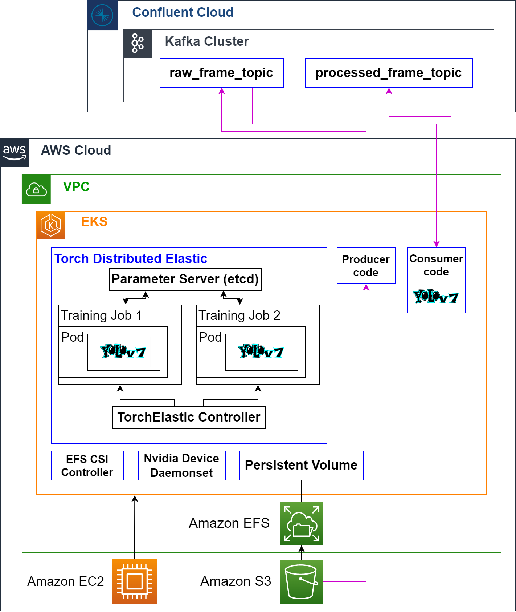
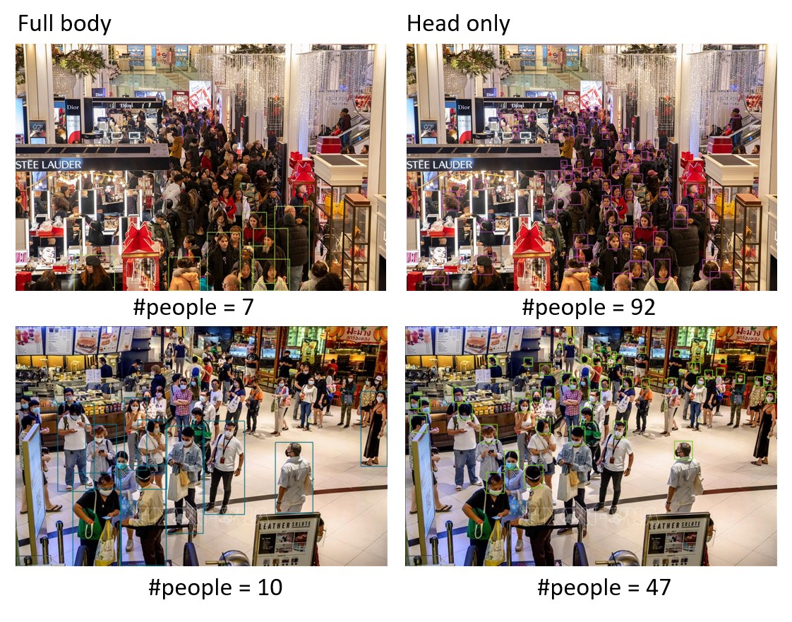

# Real time people counting system on AWS and Confluent Cloud

## Overview

In this work, we built a scalable, elastic, and distributed system to effectively detect the number of people in real-time cameras. We also deployed the system on Amazon Elastic Kubernetes Service

## Architecture

## Tools

- TorchElastic
- Docker
- Confluent Cloud
- AWS (EC2, S3, EFS EKS)

## Setting up

1. Install [`docker`](https://docs.docker.com/engine/install/ubuntu/#installation-methods)
1. Install [`kind`](https://kind.sigs.k8s.io/docs/user/quick-start/#installation)
1. Install [`helm`](https://helm.sh/docs/intro/install/)
1. Install [`kubectl`](https://kubernetes.io/docs/tasks/tools/install-kubectl-linux/#install-kubectl-binary-with-curl-on-linux)

We upload the training data to an S3 bucket. Our first intention is to connect S3 buckets with an EKS cluster to train the model even when the dataset is stored remotely. However, there is no direct
way to mount S3 storage with the EKS cluster.

Thus, we create a PersistentVolume pointing to an EFS storage. It is an intermediate storage to host the training datasets and output models. When a pod need to interact with the data stored on EFS,
it needs to create a volume mount. That way, we can have "persistent" and consistent data storage across multiple pods.

The workflow:

1. Upload the dataset to S3:
    - You can download the dataset from [here](https://github.com/HCIILAB/SCUT-HEAD-Dataset-Release).

1. Transfer the dataset from S3 to EFS:
    - As an EFS can only be accessed when mounted to an external Linux instance (local or on-the-cloud), we create a Transfer pod that runs the AWS CLI container
      image. Then we access that Pod and use AWS CLI to copy the data from S3 to EFS.
        - Create the pod: `kubect apply -f pod_aws_cli_to_stage_data.yaml`. The YAML file is located [here](pod_aws_cli_to_stage_data.yaml).
        - Access it: `kubectl exec --stdin --tty ubuntu_s3_to_efs -- /bin/bash`
        - Copy dataset from S3 -> EFS: `aws s3 cp --recursive s3://<your_bucket>/<your_dataset_folder>/ /workspace/train/datasets/`

1. Install [EFS Container Storage Interface](https://docs.aws.amazon.com/eks/latest/userguide/efs-csi.html#efs-install-driver) (CSI) driver:
    - It allows Kubernetes clusters running on AWS to manage the lifecycle of Amazon EFS file systems. First, we create an IAM policy and role
      with EFS access; then we attach them to the Kubernetes service account.

1. Create a PersistentVolume (PV) on EKS:
    - After creating an EFS, we can access the storage in an ESK cluster under the form of a PersistentVolume. PVs are volume plugins like Volumes but have a
      lifecycle independent of any individual Pod that uses the PV.
        - Run `kubect apply -f efs-sc.yaml`. Remember to use your file system id obtained from the previous step.

1. Create a PersistentVolumeClaim (PVC) on EKS:
    - To enable pods to mount the existing EFS PV, we bound the PV to a PVC. A PersistentVolumeClaim (PVC) is a request for storage by a user. While pods
      consume node resources and PVCs consume PV resources.
        - Run `kubect apply -f pvc.yaml`

## Workflow

### Training

The model training on EKS is properly distributed across multiple nodes using TorchElastic Controller. It helps communicate between pods and intermediate exchange results.
Our Kubenetes version is 1.24 with the default region is Oregon (us-west-2). We deploy 2 g4dn.xlarge nodes. Each node contains 1 GPU (Tesla T4,

Each node contains 1 GPU (Tesla T4, 15110MiB), 4 CPU, 16GB Ram and 50GB storage. Creating EKS cluster and dunning GPU-supported EC2 instances is not included in the Free-tier so have to request from
AWS. As AWS limit our access to G intances vCPUs to 8. We can only create 2 nodes (4vCPUs + 1GPU each).

> As TorchElastic distributed training is not supported for CPU, we have to perform additional setup to use GPUs as a resource type on an EKS cluster.

1. Set up GPU-supported nodes for EKS:
    - AWS Free-tier account cannot request EC2 instances with GPUs so we have to send a request to AWS to increase our quota. We use g4dn.xlarge type with the
      price of 0.526$ per hour.

1. [Install the NVIDIA device plugin for Kubernetes](https://github.com/NVIDIA/k8s-device-plugin#enabling-gpu-support-in-kubernetes):
    - This is a Daemonset that allows you to automatically expose the
      number of GPUs on each node of your cluster, keep track of the health of your
      GPUs, run GPU enabled containers in your Kubernetes cluster.

1. Build YOLOv5 image and push it to DockerHub:
    - The Pod can only run Docker containers, so we can not put the training code directly onto EKS. Instead, we carefully set up the package requirements and wrap our YOLOv5 code inside Docker images
      with the base image pytorch/pytorch:1.9.0-cuda10.2-cudnn7-devel.
        - To build, run `docker build -f Dockerfile_to_build_yolo5_image`. Here is the [Dockerfile](Dockerfile_to_build_yolo5_image)

1. To start the training, run `kubect apply -f trainer.yaml`. trainer.yaml is located [here](trainer.yaml)

1. To view the training log, run `kubectl logs yolov5-training-worker-1 -n elastic-job -f`

As distributed training on EKS is costly, the model is only trained for 20 epochs. After the training is done, the best model checkpoint is saved to the EFS directory. The training result is shown
below:

- DistributedDataParallel on 1 node: Each epoch took around 47 seconds.
- DistributedDataParallel on 2 nodes: Each epoch took around 28 seconds.

With n additional nodes, we can expect the training speeds is increased by close to n factor. In our future work, we can use Elastic Fabric Adapter (EFA)in combination with supported EC2 instance
types to accelerate network traffic between the GPU nodes

### Inferencing

In our demo, the number of partitions of each topic is set to 6. As one client
in a consumer group can only consume frames from one topic partition, partition
number should be set larger when the system is scaled up. There are two main
components in our inferencing system:

- The producer code: It is responsible for capturing frames from sources and send it to "raw_frame_topic".
- The consumer code: It stores the detecion models and estimate the number of people in each frame. It subcribes to the "raw_frame_topic", performs predictions and sends the result to the "
  processed_frame_topic". The predicted results in the "processed_frame_topic" can be sent to a data lake (a S3 bucket) for further analysis.

1. Create a Kafka Cluster on [Confluent Cloud](https://www.confluent.io/get-started/)
1. Create "raw_frame_topic" and "processed_frame_topic"
1. Build producer code and push it to the DockerHub:
    - To build, run `docker build -f Dockerfile_producer`
1. Build consumer code and push it to the DockerHub:
    - To build, run `docker build -f Dockerfile_consumer`
1. Create producer pods:
    - Run `kubect apply -f producers.yaml`
1. Create consumer pods:
    - Run `kubect apply -f consumers.yaml`

## Demo

- Distributed Training on 1 and 2 nodes: [here](https://youtu.be/_IpsX1HX50o).
- Inferencing: [here](https://youtu.be/94io0T1q8KM).
